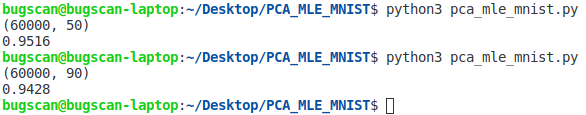

## 模式识别第一次实验

### 邹永浩 2019211168

#### 1. 读取数据 (tools.py)

根据数据的格式，使用 struct 读取数据

例如读取数据文件，idx3格式

```python
def _read_idx3(name):
    train_file = open(name, "rb")
    buf = train_file.read()
    index = struct.calcsize('>IIII')
    data = []

    while index < len(buf):
        # 图片为 784 字节
        tmp = struct.unpack_from('>784B', buf, index)
        # im.append(np.reshape(tmp, (28, 28)))
        data.append(tmp)
        index += struct.calcsize('>784B')
    
    return data
```

读取标签数据类似

#### 2. PCA 降维 (pca.py)

PCA 主要为3个步骤

```python
def PCA(X, dimensions):
    # 数据预处理，此处为原始数据减去均值
    newX = normalize2D(X)
    # 求X x X.T 的特征值和特征向量，并根据大小排序
    eigenValues, eigenVectors = eig(np.dot(newX.T, newX) / newX.shape[0])
    # 根据降维的维度，用原始数据乘特征向量进行降维
    return (np.dot(X, eigenVectors[:, :dimensions]), eigenVectors[:,:dimensions])
```

#### 3. 极大似然估计(mle.py)

MLE 主要为求均值和方差

```python
def mean2D(X):
    mean = np.zeros_like(X[0], dtype=float)
    sum = np.zeros_like(X[0], dtype=float)
    count = len(X)
    # 先计算和
    for i in range(len(X)):
        sum = sum + X[i]
    # 再计算均值
    for i in range(len(X[0])):
        mean[i] = sum[i] / count
    return mean


def cov(X, mean):
    X = np.array(X)
    tmp = X - mean
    # 计算方差，为了不让结果过大，对对角线乘0.1
    result = np.matmul(tmp.T, tmp)
    a = np.zeros(result.shape)
    np.fill_diagonal(a, 0.1)

    return np.matmul(result, a)
```

#### 4. 整体流程

```python

# 读取训练数据
train_data = tools.get_train_data()
train_label = tools.get_train_label()

# 降维
dimension = 90
train_data, eigenVectors = pca.PCA(train_data, dimension)

print(np.array(train_data).shape)

# 分别得到每一类的均值和方差
classified_data = []
for i in range(10):
    classified_data.append([])

for i in range(len(train_label)):
    classified_data[train_label[i][0]].append(train_data[i])

train_data_mean = []
train_data_cov = []
for i in classified_data:
    mean = mle.mean2D(i)
    train_data_mean.append(mean)
    train_data_cov.append(mle.cov(i, mean))

# 读取测试数据
raw_test_data = tools.get_test_data()
test_data = np.matmul(raw_test_data, eigenVectors)
test_label = tools.get_test_label()

correct = 0
count = 0

for i in range(len(test_data)):
    count += 1
    predict = np.zeros(len(train_data_mean), )
    for j in range(10):
        # 计算高斯概率值
        predict[j] = mle.gaussian(
            test_data[i], train_data_mean[j], train_data_cov[j])

    label = 0
    max = 0
    for k in range(10):
        if predict[k] > max:
            max = predict[k]
            label = k
    # 记录正确的预测
    if (label == test_label[i][0]):
        correct += 1

print(correct / len(test_data))
```

这里有个小问题，在计算高斯函数值时，由于行列式值可能过大或者过小导致计算失败，因此使用了行列式的对数进行替代

```python
def gaussian(X, mean, cov):
    tmp = X - mean

    # use logdet
    sign, logdet = np.linalg.slogdet(cov)
    return (1 / math.sqrt(np.abs(logdet))) * math.exp(- 0.5 * tmp.dot(np.linalg.inv(cov)).dot(tmp.T))

```

#### 5. 测试结果

经过多次测试，降维到50维左右性能不错，准确率在95%以上，提高到几百维或者降到太低都不是很好，在[40, 80]的区间都是可以的。



#### 6. 总结

PCA 可以很好地把维度降低，从而提高训练的准确性和系统性能；

数据预处理非常重要，尽量不让后面计算出现过大或过小的情况。